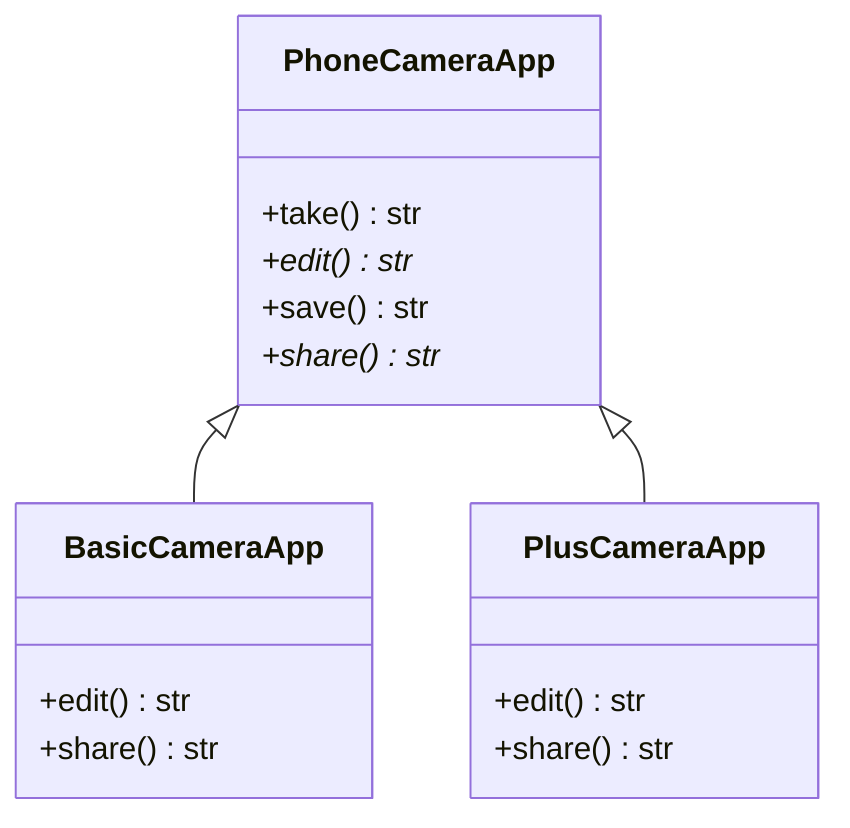

## 2. Instructions

You are working for a start-up that develops a photo app that is designed to take, edit, save and share pictures. 
Depending on the subscription plan, a user can have basic or plus features. Currently the design of the app follow 
the diagram below:

