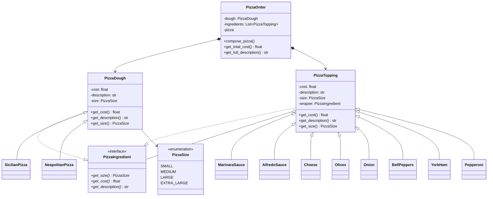

# Solution

The ensuing approach uses the **Decorator pattern** in order to allow a PizzaDough have different PizzaToppings on it
to get a full description and cost of the pizza required.

After applying the pattern, the following entities were identified:

- The **component interface** is the `PizzaIngredient`:
  - It defines methods to get size, description and cost of a pizza
  
- The **component** is the `PizzaDough` which implements the methods from the component interface. 
  - *Specific components can be derived such as the `SicilianPizza` and `NeapolitanPizza` classes*

- The **base decorator** is the `PizzaTopping` since it has a `PizzaIngredient` (component interface) as a wrapee and also
implements the methods from the component interface

- The **concrete decorators** are the toppings themselves, such as `MarinaraSauce`, `AlfredoSauce` or `Pepperoni`. They
define extra behavior to the `PizzaDough`, in this case is adding more description and cost which is needed for Pizza orders

Below is the class diagram that describes the relationships between these
entities:

