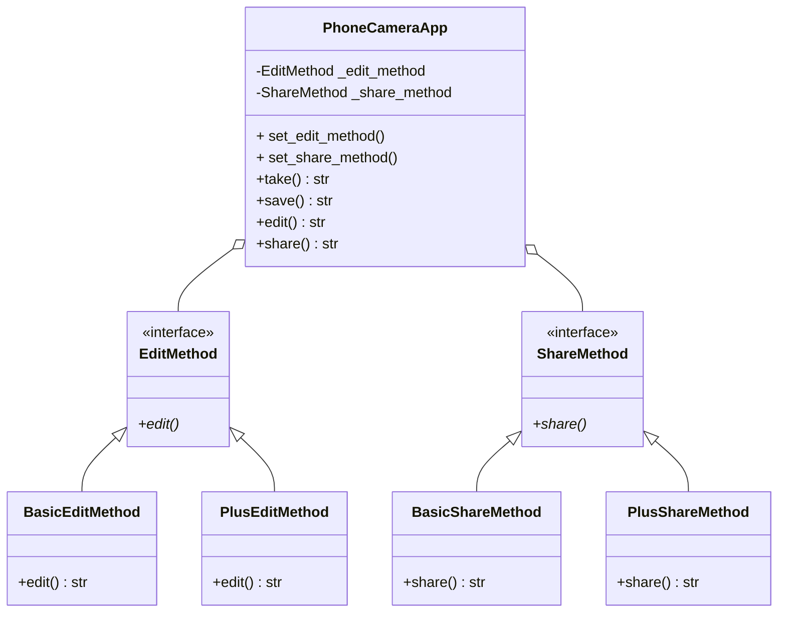

# Solution

The ensuing approach uses the Strategy pattern in order to enable the
extension or modification of new edit and share methods due to the fact that
there could be potentially multiple plans with different edit and share 
methods.

After applying the Strategy Pattern, the following entities were identified:
- The context is the PhoneCameraApp that will have two different strategies:
one for the EditMethod and one for the ShareMethod.
It will also have methods for selecting specific concrete classes:
set_edit_method and set_share_method take an instance of the necessary
strategy and set it as the concrete class.
The edit and share methods take the strategies and just invoke the methods,
the context does not need to know which specific concrete class is calling it,
it just executes the action needed.

- The first strategy corresponds to the EditMethod, which is defined as an
interface. This strategy has inherited classes that implement the edit method,
these concrete classes are BasicEditMethod and PlusEditMethod
- The second strategy corresponds to the ShareMethod, which is defined also as
an interface. In this case, BasicShareMethod and PlusShareMethod are the
concrete classes that inherit from the strategy.

- The client is the __main__.py module since it will use the context for
changing the different concrete strategies.
There is a pair of concrete strategies for each subscription plan:
set_basic_version will call the context and pass it the BasicEditMethod as the
edit strategy and BasicShareMethod as the share strategy
set_plus_version will call the context and pass it the PlusEditMethod as the
edit strategy and PlusShareMethod as the share strategy

Below is the class diagram that describes the relationships between these
entities:

