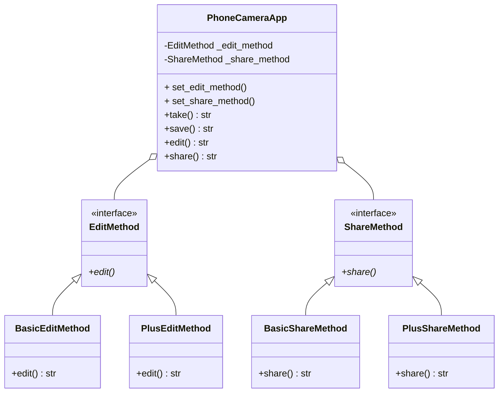

# Solution

```mermaid
classDiagram

class PhoneCameraApp
PhoneCameraApp : -EditMethod  _edit_method
PhoneCameraApp : -ShareMethod _share_method
PhoneCameraApp : + set_edit_method()
PhoneCameraApp : + set_share_method()
PhoneCameraApp : +take() str
PhoneCameraApp : +save() str
PhoneCameraApp : +edit() str
PhoneCameraApp : +share() str


class EditMethod
<<interface>> EditMethod
EditMethod: +edit()*


class ShareMethod
<<interface>> ShareMethod
ShareMethod: +share()*


class BasicEditMethod
BasicEditMethod: +edit() str

class PlusEditMethod
PlusEditMethod: +edit() str

class BasicShareMethod
BasicShareMethod: +share() str

class PlusShareMethod
PlusShareMethod: +share() str

PhoneCameraApp o-- EditMethod
PhoneCameraApp o-- ShareMethod

EditMethod <|-- BasicEditMethod
EditMethod <|-- PlusEditMethod
ShareMethod <|-- BasicShareMethod
ShareMethod <|-- PlusShareMethod
```
