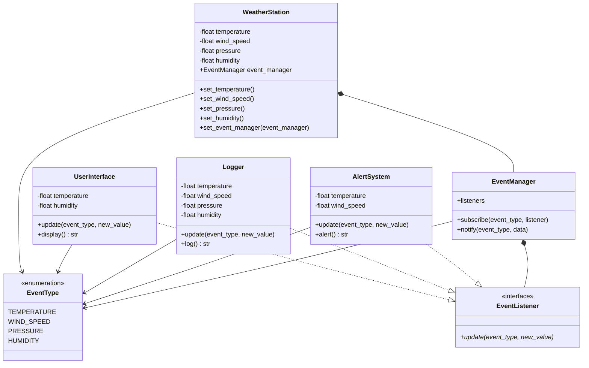

# Solution

The ensuing approach uses the **Observer pattern** in order to allow the weather station notify the other components
of the web application (user interface, loggers and system alerts) about the change in temperature, wind_speed,
pressure and humidity.

After applying the pattern, the following entities were identified:
- The **concrete publisher** is the `WeatherStation`:
  - It is composed of a base publisher
  - It receives events that will change its behaviour or properties and the base publisher will notify those events to the listeners

- The **base publisher** is the `EventManager`:
  - It keeps track of all the listeners of specific event types
  - It allows listeners to subscribe to specific event types
  - It notifies listeners of a specific event type about new data by calling the update method that the listeners
  need to implement

- The **subscribers** are the `UserInterface`, `Logger`, `AlertSystem` classes since they implement the update method from the `EventListener` interface.
This update method defines the specific way each of these classes will handle the new data of specific event types

Below is the class diagram that describes the relationships between these
entities:

