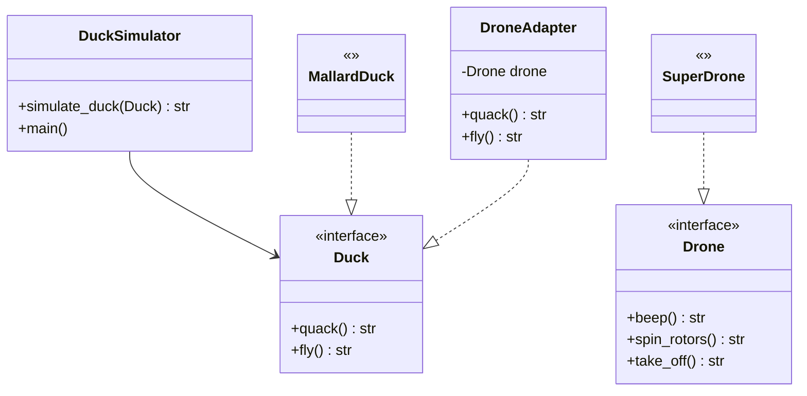

# Solution

The ensuing approach uses the **Adapter pattern** in order to allow the client to be able to
simulate ducks with drones without making any changes to the client itself.

After applying the Adapter Pattern, the following entities were identified:
- The **client** is the `DuckSimulator`. It takes a Duck instance and simulates its behaviour
with the simulate_duck static method

- The **service** is the `Drone`, since it has an incompatible interface with the client (it is
not a Duck)

- The **adapter** is the `DroneAdapter` and it will be in charge of implementing the methods
that the client needs. What I mean by this is that it will inherit from the Duck interface
(the client needs a Duck) and implement the Duck methods using the methods available in 
the Drone interface.

Below is the class diagram that describes the relationships between these
entities:

