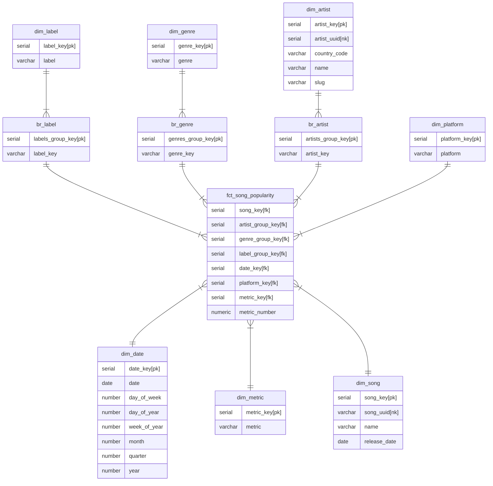
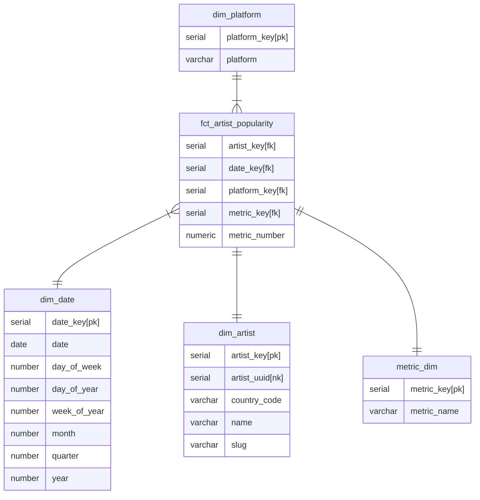

A dbt project was created in order to perform the transformations required. As mentioned before, we opt out to have 4 layers: raw, bronze, silver and gold.

The dbt project reads the data from the raw layer which has the following tables:
- ARTIST_METADATA
- LOCAL_AUDIENCE
- SONG_METADATA
- SONGS_AUDIENCE
- SONGS_BY_ARTIST
- SONGS_POPULARITY
- TOP_ARTISTS

And inserts current day data into the corresponding staging tables in the bronze layer:
- STG_ARTIST_METADATA
- STG_ARTIST_LOCAL_AUDIENCE
- STG_SONG_METADATA
- STG_SONG_AUDIENCE
- STG_ARTIST_SONGS
- STG_SONG_POPULARITY
- STG_TOP_ARTIST

The data from staging is processed and moves into the silver layer with dimension and fact tables according to Kimball’s modeling technique, resulting in the following tables:

- BR_ARTIST
- BR_GENRE
- BR_LABEL
- DIM_ARTIST
- DIM_DATE
- DIM_GENRE
- DIM_LABEL
- DIM_METRIC
- DIM_PLATFORM
- DIM_SONG
- FCT_ARTIST_POPULARITY
- FCT_SONG_POPULARITY

The fact tables are loaded incrementally using dbt. The reason for this is that we want our fact table to grow while avoiding reliance on the API in case they update a metric late due to eventual consistency issues.

We had to create bridge tables due to the fact the a song could have multiple genres, labels or artists. Each bridge table has a corresponding group key and all the elements corresponding to that key. They are used in the FCT_SONG_POPULARITY table which contains songs information associated with specific groups.

The gold layers serves as a fast access for reports, the following tables were created:

- ARTISTS_COUNTRIES_INFO
- ARTISTS_INFO
- SONGS_ARTISTS_INFO
- SONGS_INFO

Additionally to the models for each layer, we also performed the following:

Created seed for populating country names
Used generic tests on needed models
Used macros to overwrite schemas default behavior from dbt (generate_schema_name)

The following ER diagrams represent the relationships for the songs snapshot fact table, artists snapshot fact table 

